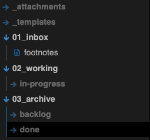
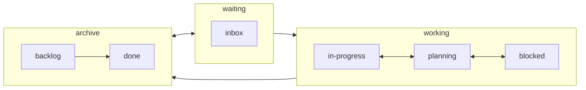

# Obsidian Bellboy

Bellboy is built to be an opinionated file structure manager for Obsidian.   
Aiming keeping a clean and readable knowledge management file system 
while turning meanial tasks of note renaming and organizing redundant.

## Features

### File naming scheme

Bellboy looks up for the first header in you file, converts it to `kebab-case` and renames your file to match it.

In addition, if an `icon` frontmatter is added, this icon would be added to the name as well, so you could find your files more easily.

#### *But Why?*
Wishing to maintain a file system agnostic naming scheme for files, I chose to use `kebab-case` as our main naming convention style.   
And to support a better visual flare I've also added frontmatter icons(!) that are integrated into the file names.

### File structure

Bellboy attempt to implement the `Idea Processor` method guidelines that aims at improving your output by automatically managing your idea's process and letting you focus on the execution.
It does this by looking up your metadata status when you update it and moving the file to a folder corresponding it current state.

#### Idea Processor
It is a method based on R&D ideation process, where every idea goes from the inbox, and through a validation process to either it's execution or abandoment. Used in multiple professional domains and aims at optimizing the execution output, maximizing our potential.

Below we can find the general status flow in the process, futrher reading materials will be added soon.

## Contributuion
## How to report bugs

As this is an experimental plugin, bugs are expected to occur. Kindly open an issue in this repository and describe in detail what bug you encountered.

### How to run locally
- Clone this repo.
- `npm i` or `yarn` to install dependencies
- `npm run dev` to start compilation in watch mode.

### Manually installing the plugin
- Copy over `main.js`, `styles.css`, `manifest.json` to your vault `VaultFolder/.obsidian/plugins/obsidian-bellboy/`.

### API Documentation
See https://github.com/obsidianmd/obsidian-api
